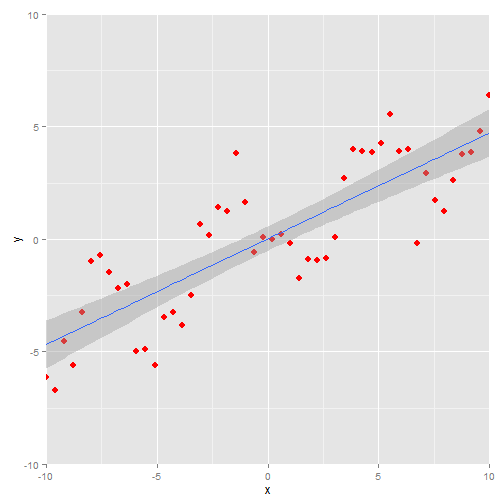
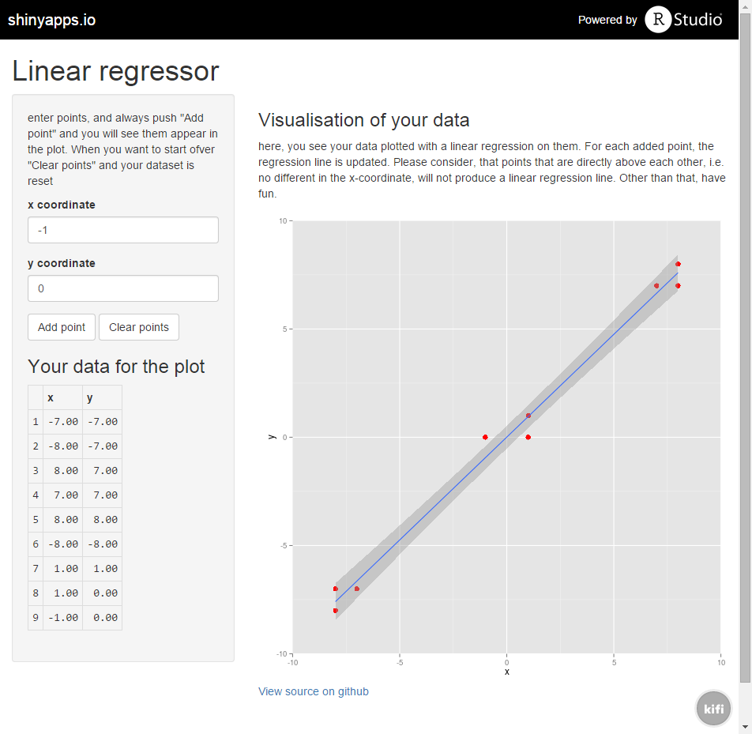

Linear Regressor
========================================================
author: Daniel Fabian
date: 18 June 2015
transition: rotate

Interactive dataset
========================================================

Start off with empty data set

- add points
- reset dataset (if you want to start over)
- dataset and plot always in sync

Dataset
========================================================

tabular view of data

<!-- html table generated in R 3.2.0 by xtable 1.7-4 package -->
<!-- Thu Jun 18 18:10:41 2015 -->
<table border=1>
<tr> <th>  </th> <th> x </th> <th> y </th>  </tr>
  <tr> <td align="right"> 1 </td> <td align="right"> 7.34 </td> <td align="right"> -7.77 </td> </tr>
  <tr> <td align="right"> 2 </td> <td align="right"> -2.64 </td> <td align="right"> 7.33 </td> </tr>
  <tr> <td align="right"> 3 </td> <td align="right"> -2.81 </td> <td align="right"> -2.89 </td> </tr>
  <tr> <td align="right"> 4 </td> <td align="right"> 6.12 </td> <td align="right"> -1.70 </td> </tr>
  <tr> <td align="right"> 5 </td> <td align="right"> -0.23 </td> <td align="right"> 0.89 </td> </tr>
   </table>

Linear regression plot
========================================================

 

UI Screenshot
========================================================

